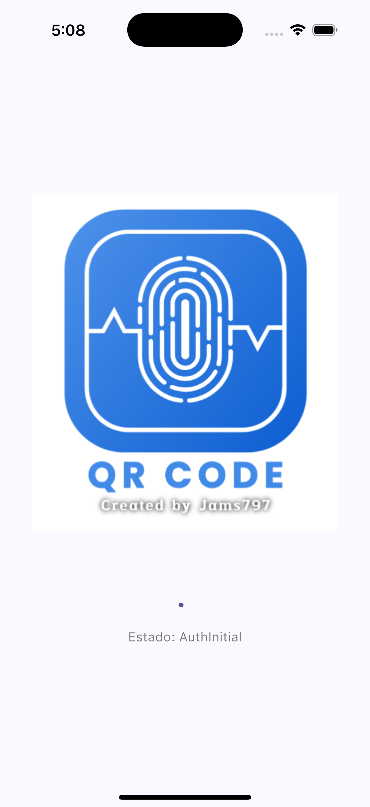
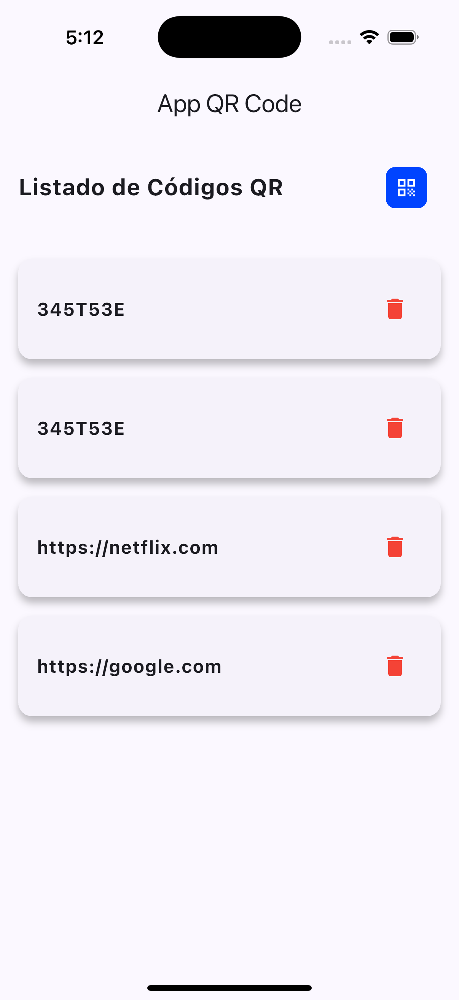
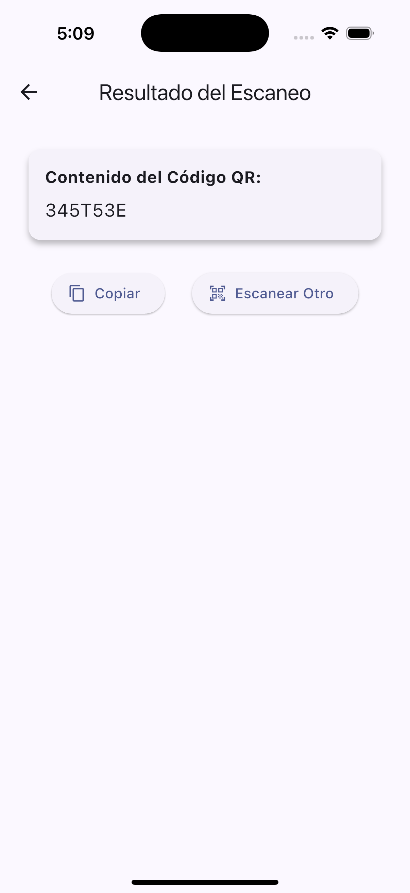

# Jams Flutter Swift

Proyecto en flutter con componentes nativos de iOS (Swift) para el scaneo del QR y authenticación por biometrico/pin

## Tabla de contenidos:
---

- [Complementos/Funcionalidades](complementosfuncionalidades)
- [Pantallas](#pantallas)
- [Requisitos](#requisitos)
- [Instalación/Configuración](#instalaciónconfiguración)
- [Pruebas unitarias](#pruebas-unitarias)
- [Estructura](#estructura)
- [Detalle](#detalle)

## Complementos/Funcionalidades

Realiza el funcionamiento de componentes nativos y librerias para ciertos procesos

- **Nativos (Swift)**
    - QR
        - Preview de camara
        - Detector de código
    - Authenticate
        - Lectura de biometrico
- **Librerias**
    - DB
        - Sqlite
        - equatable
    - Sqlite
    - Otras
        - flutter_bloc
        - go_router
        - permission_handler
        - path_provider
        - ...

Cuenta con pruebas unitarias

Desarrollada con Flutter y módulos nativos

## Pantallas
| Splash | Login | Home | Result |Scan QR |
|--------|-------|------|--------|--------|
|  | |  |  |

## Requisitos
- Xcode 12.0 o superior
- Dispositivo compatible con biometrico
- Dart SDK 3.7.2
- Flutter SDK 3.29.2

## Instalación/Configuración
1. Descargar el proyecto
2. Obtener las dependencias y configurar
    ### Con flutter directo
    ```bash
    flutter pub get
    ```
    ### Con FVM
    ```bash
    fvm install
    fvm flutter pub get
    ```
3. Abrir el Xcode para dar los permisos de compilación al proyecto
4. Ejecutar la aplicación
    ### Con flutter directo
    ```bash
    flutter run
    ```
    ### Con FVM
    ```bash
    fvm flutter run
    ```

## Pruebas unitarias
Se realizarón las pruebas sin inconvenientes

### Ejecución
  #### Con flutter directo
  ```bash
  flutter test test/data/auth_process.dart --coverage
  ```
  #### Con FVM
  ```bash
  fvm flutter test test/data/auth_process.dart --coverage
  ```

## Estructura

```
lib/                                                # Todos los archivos del proyecto
├── main.dart                                       # Inicializador
├── core/                                           # Contiene el la capa de constantes y helpers
│   ├── helpers/                                    # Los Helper son los metodos/funciones reutilizables
│   │   ├── dbresources/                            # Carpeta para la estructura de BD
│   │   │   └── database_helper.dart                # Estructura de conexión a la BD local
│   │   ├── interfaces/                             # Interfaces para los repositorios
│   │   │   ├── auth_rep_interface.dart             # Interfaz para la authenticación
│   │   │   └── qr_code_rep_interface.dart          # Interfaz para el código QR
│   │   ├── models/                                 # Modelos reutilizables en el aplicativo
│   │   │   ├── qr_code_model.dart                  # Modelo del codigo QR
│   │   │   ├── qr_data_model.dart                  # Modelo para los datos del QR en BD
│   │   │   └── router_model.dart                   # Configuración y mapeo de rutas
│   │   ├── repositories/                           # Repositorio de las configuraciones de los canales
│   │   │   ├── auth_repository.dart                # Repositorio de biometrico
│   │   │   └── qr_code_repository.dart             # Repositorio del QR
│   │   └── statics/                                # Datos estáticos que sirven de configuración del aplicativo
│   │       ├── var_routers.dart                    # Rutas para el Go router
│   │       ├── var_statics.dart                    # Variables de configuración
│   │       └── var_styles.dart                     # Configuraciones de estilo
│   └── router/                                     # Configuracion de rutas
│       └── app_router.dart                         # Archivo con las rutas
├── bloc/                                           # Configuraciones de los estados
│   ├── auth_bloc.dart                              # Bloc del biometrico
│   └── qr_bloc.dart                                # Bloc del código Qr
└── pages/                                          # Pantalla
    ├── login_page.dart
    ├── splash_page.dart
    └── home/
        ├── home_page.dart
        ├── qr_detail_page.dart
        ├── qr_result_page.dart
        └── qr_scanner_page.dart
```

## Detalle
Created by [Jams797](https://jams797.com/).