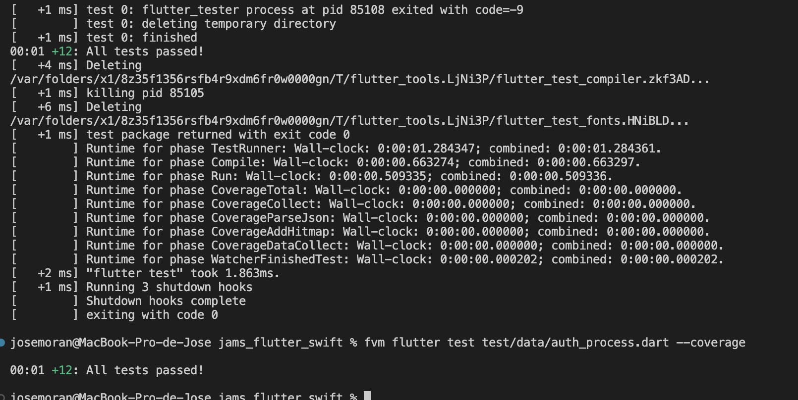

# Jams Flutter Swift

Proyecto en flutter con componentes nativos de iOS (Swift) para el scaneo del QR y authenticación por biometrico/pin

## Tabla de contenidos:
---

- [Complementos/Funcionalidades](complementos/funcionalidades)
- [Pantallas](#pantallas)
- [Requisitos](#requisitos)
- [Instalación/Configuración](#instalación/configuracion)
- [Pruebas unitarias](#pruebas-unitarias)
- [Estructura](#estructura)
- [Detalle](#detalle)

## Complementos/Funcionalidades

Realiza el funcionamiento de componentes nativos y librerias para ciertos procesos

- **Nativos (Swift)**
    - QR
        - Preview de camara
        - Detector de código
    - Authenticate
        - Lectura de biometrico
- **Librerias**
    - DB
        - Sqlite
        - equatable
    - Sqlite
    - Otras
        - flutter_bloc
        - go_router
        - permission_handler
        - path_provider
        - ...

Cuenta con pruebas unitarias

esarrollada con Flutter y módulos nativos en Android (Kotlin).

## Pantallas
| Splash | Login | Home | Result |Scan QR |
|--------------------------|------|------------|-----------------|
|  | |  |  |

## Requisitos
- Xcode 12.0 o superior
- Dispositivo compatible con biometrico
- Dart SDK 3.7.2
- Flutter SDK 3.29.2

## Instalación/Configuración
1. Descargar el proyecto
2. Obtener las dependencias y configurar
    ### Con flutter directo
    ```bash
    flutter pub get
    ```
    ### Con FVM
    ```bash
    fvm install
    fvm flutter pub get
    ```
3. Abrir el Xcode para dar los permisos de compilación al proyecto
4. Ejecutar la aplicación
    ### Con flutter directo
    ```bash
    flutter run
    ```
    ### Con FVM
    ```bash
    fvm flutter run
    ```

## Pruebas unitarias
Se realizarón las pruebas sin inconvenientes

### Ejecución
  #### Con flutter directo
  ```bash
  flutter test test/data/auth_process.dart --coverage
  ```
  #### Con FVM
  ```bash
  fvm flutter test test/data/auth_process.dart --coverage
  ```

## Estructura

## Detalle
Created by [Jams797](https://jams797.com/).